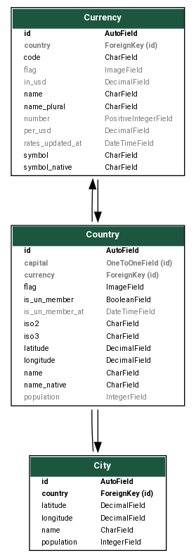

# DRF Demo

DRF Demo is a [Django REST Framework](https://github.com/encode/django-rest-framework) project reference for a [City](./location/models.py), [Country](./location/models.py), and [Currency](./currency/models.py) fixture API.



The codebase associated with this project provides a comprehensive implementation of the following features:

- **Heroku**-compatible environment and **dependency management** using the [Pipenv](https://github.com/pypa/pipenv) library -- See [Pipfile](./Pipfile) | [Pipfile.lock](./Pipfile.lock).

- **Environment-specific project settings** with a `.env` file and the [Python Decouple](https://github.com/henriquebastos/python-decouple/) library -- See [settings.py](./config/settings.py) | [.env](./.env.example)

- **Custom User model** that uses an email address instead of a username -- See [settings.py](./config/settings.py) | [user.models.py](./user/models.py)

- **Manual fixture migrations** for initial database population -- See [populate_locations.py](./location/migrations/0002_populate_locations.py) | [populate_currencies.py](./currency/migrations/0002_populate_currencies.py)

- **PostgreSQL** database configuration settings in conjunction with the [psycopg2](https://github.com/psycopg/psycopg2) database adapter -- See [settings.py](./config/settings.py)

- **Amazon AWS S3**-compatible static and media **file hosting** configuration settings in conjunction with the [boto3](https://github.com/boto/boto3) and [django storages](https://github.com/jschneier/django-storages) libraries -- See [settings.py](./config/settings.py) | [storages.py](./config/storages.py)

- **Celery** and **Redis**-compatible project settings for **scheduled and background tasks** in conjunction with [Celery](https://github.com/celery/celery) and [redis-py](https://github.com/andymccurdy/redis-py) -- See [settings.py](./config/settings.py) | [celery.py](./config/celery.py) | [Procfile](./Procfile) | [currency.tasks.py](./currency/tasks.py)

- **Nested API routes** that model database relations in conjunction with the [drf-nested-routers](https://github.com/alanjds/drf-nested-routers) library -- See [api.urls](./api/urls.py)

- **Searchable, sortable, and filterable** endpoints with **side-loadable and traversable relations** in conjunction with the [Dynamic REST](https://github.com/AltSchool/dynamic-rest) library -- See serializers.py and views.py in each project submodule.

- **Unit testing** for models and views -- See test_models.py and test_views.py in the tests directory of each project submodule.

- **Heroku** deployment-ready project settings and release script in conjunction with the [Django-Heroku](https://github.com/heroku/django-heroku) library -- See [settings.py](./config/settings.py) | [Procfile](./Procfile) | [release.sh](./release.sh)

## Live Demo

The [live demo](https://drf-demo-backend-production.herokuapp.com/api/) of this project is hosted on a Heroku free tier pipeline and may take up to 30 seconds to wake up.

### Endpoints

For convenience, the Django REST Framework browsable API feature has been enabled so that you can easily navigate through the following publicly available endpoints:

<div align="center">

| Endpoint                                                                                                                       | Description                               |
| ------------------------------------------------------------------------------------------------------------------------------ | ----------------------------------------- |
| [api / cities /](https://drf-demo-backend-production.herokuapp.com/api/cities)                                                 | All 2,174 cities in database              |
| [api / countries /](https://drf-demo-backend-production.herokuapp.com/api/countries)                                           | All 250 countries in database             |
| [api / countries / :id / cities / (:id) /](https://drf-demo-backend-production.herokuapp.com/api/countries/237/cities)         | All cities that belong to a given country |
| [api / currencies /](https://drf-demo-backend-production.herokuapp.com/api/currencies)                                         | All 114 currencies in database            |
| [api / currencies / :id / countries / (:id) /](https://drf-demo-backend-production.herokuapp.com/api/currencies/106/countries) | All countries that use a given currency   |

</div>

Note that the country and currency endpoints accept ID lookups as well as field lookups.

The country endpoint accepts ID, ISO2, and ISO3 lookups; the following return the same response:

- [api / countries / 237 /](https://drf-demo-backend-production.herokuapp.com/api/countries/237)
- [api / countries / US /](https://drf-demo-backend-production.herokuapp.com/api/countries/US)
- [api / countries / USA /](https://drf-demo-backend-production.herokuapp.com/api/countries/USA)

The currency endpoint accepts ID and currency code lookups; the following return the same response:

- [api / currencies / 106 /](https://drf-demo-backend-production.herokuapp.com/api/currencies/106)
- [api / currencies / USD /](https://drf-demo-backend-production.herokuapp.com/api/currencies/USD)

### Sideloading

This project utilizes sideloading as opposed to nested serializers to present related data for the following reasons:

- Retains a flatter data structure more closely representing that of a row in an SQL database

- Reduces data duplication in cases where many objects share a relation thus reducing overall payload; a nested serializer will repeat data for every shared relation while a sideloaded relation need only appear once

- Allows the client to choose which sideloaded relations to fetch, if any, without affecting the underlying data structure of the default response

The following request will fetch all available cities and sideload their country foreign key relation:

- <a href="https://drf-demo-backend-production.herokuapp.com/api/cities/?include[]=country.*">api / cities / ? include[] = country.*</a>

The following request will fetch all available countries and sideload their capital and currency foreign key relations:

- <a href="https://drf-demo-backend-production.herokuapp.com/api/countries/?include[]=capital.*&include[]=currency.*">api / countries / ? include[] = capital.* & include[] = currency.*</a>

The following request will fetch all available currencies and sideload their country foreign key relation:

- <a href="https://drf-demo-backend-production.herokuapp.com/api/currencies/?include[]=country.*">api / currencies / ? include[] = country.*</a>

### Searching

Each endpoint in this project offers a general search or "autocomplete" feature that will perform a case-insensitive string search across one or multiple pre-defined fields.

In the case of the city endpoint, search will return results matching `City.name`:

- [api / cities / ? search = ous](https://drf-demo-backend-production.herokuapp.com/api/cities/?search=ous)

The country endpoint search will return results matching `Country.name` and `Country.name_native`:

- [api / countries / ? search = kor](https://drf-demo-backend-production.herokuapp.com/api/countries/?search=kor)
- [api / countries / ? search = 한](https://drf-demo-backend-production.herokuapp.com/api/countries/?search=한)

Finally, the currency endpoint search will return results matching `Currency.name`, `Currency.code`, `Currency.number`, and `Currency.country.name`:

- [api / currencies / ? search = dollar](https://drf-demo-backend-production.herokuapp.com/api/currencies/?search=dollar)
- [api / currencies / ? search = sd](https://drf-demo-backend-production.herokuapp.com/api/currencies/?search=sd)
- [api / currencies / ? search = 40](https://drf-demo-backend-production.herokuapp.com/api/currencies/?search=40)
- [api / currencies / ? search = united](https://drf-demo-backend-production.herokuapp.com/api/currencies/?search=united)

### Sorting

Each endpoint in this project supports sorting results by one or more fields, and in either direction.

The following requests will sort all available countries by name, ascending and descending respectively:

- <a href="https://drf-demo-backend-production.herokuapp.com/api/countries/?sort[]=name">api / countries / ? sort[] = name</a>
- <a href="https://drf-demo-backend-production.herokuapp.com/api/countries/?sort[]=-name">api / countries / ? sort[] = -name</a>

The following request will sort all available countries by United Nations member status, date of admission to the United Nations, and country name, respectively -- or more simply: by ascending date of membership:

- <a href="https://drf-demo-backend-production.herokuapp.com/api/countries?sort[]=-is_un_member&sort[]=is_un_member_at&sort[]=name">api / countries / ? sort[] = -is_un_member & sort[] = is_un_member_at & sort[] = name</a>

Sorting may also be applied accross database relations through dot notation.

The following request will sort all available countries by descending capital population, i.e. largest first:

- <a href="https://drf-demo-backend-production.herokuapp.com/api/countries?sort[]=-capital.population">api / countries / ? sort[] = -capital.population</a>

Note that results with null values appear at the end of ascending lists by default, which means they appear at the beginning of the above results list. Refer to the [Filtering](#filtering) section for an example of how to omit them altogether.

### Filtering

Each endpoint in this project supports filtering results by one or more field values.

Once again, dot notation can be used to apply a filter operation accross database relations.

#### Exact

The `exact` filter will match results based on the exact value of a given field or set of fields:

The following request will return a list of countries that are currently UN member states:

- <a href="https://drf-demo-backend-production.herokuapp.com/api/countries?filter{is_un_member_at}=1945-10-24">api / countries / ? filter{is_un_member} = true</a>

The following request will return a list of countries that became UN member states when the UN was founded:

- <a href="https://drf-demo-backend-production.herokuapp.com/api/countries?filter{is_un_member_at}=1945-10-24">api / countries / ? filter{is_un_member_at} = 1945-10-24</a>

The following request will return a list of countries that use the US Dollar as their primary currency:

- <a href="https://drf-demo-backend-production.herokuapp.com/api/countries?filter{currency.code}=USD">api / countries / ? filter{currency.code} = USD</a>

Note that the above request will return results that are equivalent to those of the country of currency endpoint:

- [api / currencies / USD / countries /](https://drf-demo-backend-production.herokuapp.com/api/currencies/USD/countries)

Note also that the `iexact` modifier can be added to string queries to make them case-insensitive:

- <a href="https://drf-demo-backend-production.herokuapp.com/api/countries?filter{currency.code.iexact}=Usd">api / countries / ? filter{currency.code.iexact} = Usd</a>

#### In

The `in` filter will match results based on whether the exact value of a given field is one of a list of values.

The following request will return a list of countries consisting of the United States and Australia:

- <a href="https://drf-demo-backend-production.herokuapp.com/api/countries?filter{iso3.in}=USA&filter{iso3.in}=AUS">api / countries / ? filter{iso3.in} = USA & filter{iso3.in} = AUS</a>

The following request will return a list of countries that use either the US Dollar or the Australian Dollar:

- <a href="https://drf-demo-backend-production.herokuapp.com/api/countries?filter{currency.code.in}=USD&filter{currency.code.in}=AUD">api / countries / ? filter{currency.code.in} = USD & filter{currency.code.in} = AUD</a>

#### Contains

The `contains` filter will match results based on whether the value of a given string field contains a substring.

The following request will return a list of countries whose name contains "den", i.e. Sweden:

- <a href="https://drf-demo-backend-production.herokuapp.com/api/countries?filter{name.contains}=den">api / countries / ? filter{name.contains} = den</a>

Note that an `i` modifier can be prefixed to this filter to make it case insensitive.

The following request will do the same without regard to case, i.e. Denmark and Sweden:

- <a href="https://drf-demo-backend-production.herokuapp.com/api/countries?filter{name.icontains}=den">api / countries / ? filter{name.icontains} = den</a>

#### Startswith and Endswith

The `startswith` and `endswith` filters match results based on whether the value of a given string field either starts or ends with a specified substring. Again, the `i` operator can be applied to make them case-insenstive.

The following requests will return a list of countries whose name starts with "United":

- <a href="https://drf-demo-backend-production.herokuapp.com/api/countries?filter{name.startswith}=United">api / countries / ? filter{name.startswith} = United</a>
- <a href="https://drf-demo-backend-production.herokuapp.com/api/countries?filter{name.istartswith}=united">api / countries / ? filter{name.istartswith} = united</a>

The following requests will return a list of countries whose name ends with the suffix "-ia":

- <a href="https://drf-demo-backend-production.herokuapp.com/api/countries?filter{name.endswith}=ia">api / countries / ? filter{name.endswith} = ia</a>
- <a href="https://drf-demo-backend-production.herokuapp.com/api/countries?filter{name.iendswith}=IA">api / countries / ? filter{name.iendswith} = IA</a>

#### Greater Than and Less Than

#### Is Null

The following request will return a list of currencies that do not have a primary issuing country, e.g. the Euro:

- <a href="https://drf-demo-backend-production.herokuapp.com/api/currencies?filter{country.isnull}=true">api / currencies / ? filter{country.isnull} = true</a>

The following request will return a list of countries whose capitals have a non-null population:

- <a href="https://drf-demo-backend-production.herokuapp.com/api/countries?filter{capital.population.isnull}=false">api / countries / ? filter{capital.population.isnull} = false</a>

#### Inversions

The results of any of the above filter operations can also be inverted in a similar way a reverse sort works.

The following request returns a list of countries whose names DO NOT start with the word "United":

- <a href="https://drf-demo-backend-production.herokuapp.com/api/countries?filter{-name.startswith}=United">api / countries / ? filter{-name.startswith} = United</a>

The following request returns a list of countries that DO NOT use the US Dollar as their primary currency:

- <a href="https://drf-demo-backend-production.herokuapp.com/api/countries?filter{-currency.code}=USD">api / countries / ? filter{-currency.code} = USD</a>

#### Further Reading

Refer to the [Dynamic REST repository](https://github.com/AltSchool/dynamic-rest) and [documentation](https://dynamic-rest.readthedocs.io/en/latest/) for further information on supported operations.

## Local Installation

### Repository

Clone this repository into a directory of your choosing:

```console
$ git clone https://github.com/khunspoonzi/drf-demo.git
```

Navigate into the root directory of the newly cloned repository:

```console
$ cd drf-demo
```

### Environment

Rename `.env.example` to `.env` so that your environment variables are read into the Django settings module.

If you don't already have `Pipenv` installed in your machine, install it now:

```console
$ pip install --user pipenv
```

Initialize a `Pipenv` shell:

```console
$ pipenv shell
```

Install project dependencies:

```console
$ pipenv install
```

Assuming you have `USE_LOCAL_STORAGE` set to `True` in your `.env`, be sure to collect your static files locally:

```console
$ python manage.py collectstatic
```

### Database

If you haven't already installed Postgres on your machine, [do so now](https://www.postgresql.org/download/).

Create a Postgres database named `drf-demo`. On a Linux system, the following suffices:

```console
$ sudo -u postgres createdb "drf-demo"
```

Initialize your database tables and populate your database fixtures:

```console
$ python manage.py migrate
```

### Server

Run the local server:

```console
$ python manage.py runserver
```

If you wish to test background and scheduled tasks, be sure to [install Redis](https://redis.io/download) and start your server this way:

```console
$ heroku local
```

The above command will invoke your Celery worker and connect it to Redis in addition to starting your server.

### Django Admin

If you wish to log into and access the Django Admin panel, be sure to create a superuser first:

```console
$ python manage.py createsuperuser
```

You'll be able to log in via the `/admin/` route of your running server.
